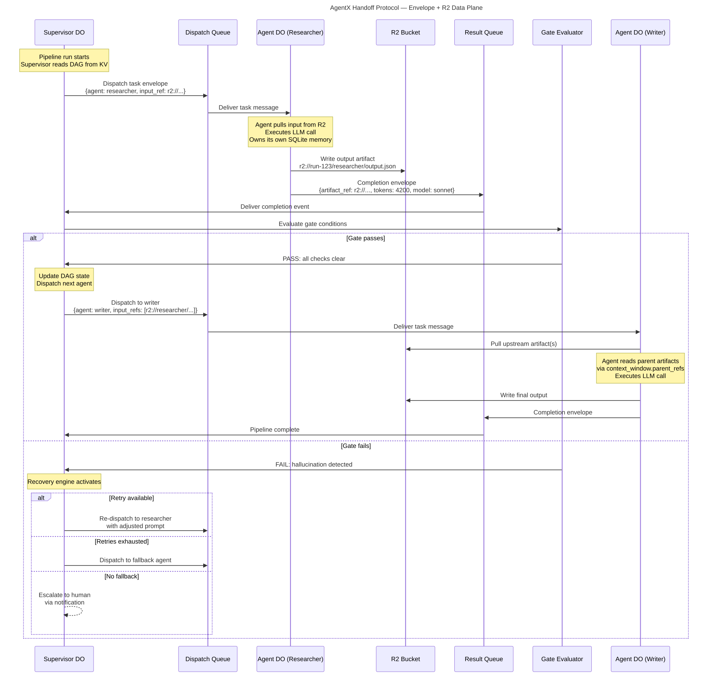

# AgentX Factory

Multi-agent pipeline orchestration on Cloudflare Workers. Define agent workflows in YAML, deploy to the edge, get durable execution with automatic failure recovery.

## What it does

You write a YAML file that describes a pipeline of LLM agents. Each agent has a role, a model tier, and a memory budget. The factory spins up isolated Durable Objects for each agent, dispatches work through Queues, evaluates quality gates between steps, and collects the results into R2.

```yaml
agents:
  - id: security
    role: Review the diff for vulnerabilities
    model: execution
  - id: performance
    role: Review the diff for bottlenecks
    model: execution
  - id: synthesizer
    role: Merge all findings into one report
    model: planning

pipeline:
  - step: review
    agents: [security, performance]
    mode: parallel
  - step: gate
    type: gate
    condition: all_agents_completed
  - step: synthesize
    agent: synthesizer
    inputs: [security, performance]
```

One API call starts the pipeline. Each agent runs independently, writes its output to R2, and reports back to a Supervisor that tracks the whole DAG. If an agent fails, the Supervisor retries it. If the gate fails, the pipeline stops cleanly with a full audit trail.

## Architecture



A **Supervisor Durable Object** owns the pipeline state machine. It parses the YAML into a DAG, creates an **Agent Durable Object** per agent, and dispatches tasks through Cloudflare Queues. Agents make Anthropic API calls, write artifacts to R2, and report completions back via a result queue. The Supervisor evaluates gates and decides what happens next.

Every piece of state lives in the right place:
- Agent memory → Agent DO's SQLite (isolated, no shared state)
- Pipeline DAG → Supervisor DO's SQLite (single source of truth)
- Artifacts → R2 (unlimited size, exact-key reads)
- Config → KV (pipeline YAML, runtime settings)
- Task dispatch → Queues (reliable delivery, built-in retry)

### Handoff Protocol



Control flow routes through the Supervisor. Data flows through R2. Queue messages carry lightweight envelopes (< 1KB) with R2 references — never the actual payloads. This sidesteps the 128KB Queue message limit and keeps the control plane lean.

### Pipeline Lifecycle



Pipelines move through a state machine: Submitted → Validating → Planning → Dispatching → Running → GateCheck → Completing → Completed. Failed agents trigger a Recovery sub-state-machine with retry, fallback, and human escalation paths.

### Gates and Circuit Breakers



Gates are Supervisor state transitions, not separate services. They fire on token budget overruns, agent timeouts, hallucination flags, or schema validation failures. Circuit breakers track per-agent-role failure rates and fast-fail when an agent is consistently broken.

## Stack

| Layer | Technology |
|-------|-----------|
| Runtime | Cloudflare Workers |
| Agent state | Durable Objects (transactional SQLite) |
| Task dispatch | Cloudflare Queues |
| Artifacts | R2 |
| Config | KV |
| LLM | Anthropic (Claude Opus / Sonnet / Haiku) |
| HTTP framework | Hono |
| Validation | Zod |
| Tests | Vitest |

## API

```
POST   /api/pipelines              Upload pipeline YAML
GET    /api/pipelines              List pipelines
GET    /api/pipelines/:name        Get pipeline YAML
DELETE /api/pipelines/:name        Delete pipeline

POST   /api/runs                   Start a pipeline run
GET    /api/runs                   List runs
GET    /api/runs/:id               Get run state (DAG, agent statuses, metrics)
GET    /api/runs/:id/events        Get pipeline event log
GET    /api/runs/:id/artifacts/:key Download an artifact

GET    /api/health                 Health check
```

## Dashboard

Once deployed, the worker root serves an HTMX-driven dashboard:

- `/` — home
- `/runs` — list of every pipeline run
- `/runs/:id` — live DAG (Mermaid), event stream (SSE), per-agent table
- `/pipelines` — list and inspect uploaded pipelines, kick off new runs

The DAG auto-refreshes every 3 seconds; events stream live via
`/api/runs/:id/stream` (SSE).

## Quick start

```bash
# Install
npm install

# Run tests
npx vitest run        # 137 tests

# Local dev (in-memory simulators — no Cloudflare account needed)
npx wrangler dev

# Production deploy
npx wrangler deploy
```

For the full deployment walkthrough — including resource provisioning, the
`wrangler.toml` patch you'll need, smoke tests, and common failure modes — see
**[SETUP.md](./SETUP.md)**.

### Run a pipeline

```bash
URL="https://agentx-factory.YOUR_SUBDOMAIN.workers.dev"

# Upload the built-in code review pipeline
curl -X POST $URL/api/pipelines \
  -H "Content-Type: text/yaml" \
  --data-binary @pipelines/code-review.yaml

# Start a review
curl -X POST $URL/api/runs \
  -H "Content-Type: application/json" \
  -d '{"pipeline":"code-review","input":{"diff":"+ const x = eval(userInput)"}}'

# Watch the run in the dashboard
open "$URL/runs/<run-id-from-above>"
```

## Advanced features

**Multi-turn agents.** Set `turns.max` (and optionally `stop_when`) on an agent
to let it iterate. Useful when paired with tools or for long-form generation.

```yaml
agents:
  - id: deep-dive
    role: ...
    turns: { max: 4, stop_when: "FINAL_ANSWER" }
```

**Agent tool use.** Built-in tools: `read`, `grep` (R2-scoped), plus stubs for
`semgrep` and `test-runner`. Tools are sandboxed to the run's R2 prefix and
capped at 10 s wall clock per call.

```yaml
agents:
  - id: investigator
    tools: [read, grep]
```

**Conditional steps.** Skip a step at runtime based on prior agent output or
metrics. Whitelisted DSL — no `eval`.

```yaml
pipeline:
  - step: deep-dive
    agent: deep-dive
    when: agent.triage.tokens > 2000 and not gate.budget.failed
```

**Pipeline composition.** Reuse blocks via `import:` (one level deep, agent and
step IDs get a prefix to avoid collisions).

```yaml
pipeline:
  - step: security-review
    import: security-base   # pulls in security-base.yaml's agents and steps
```

**Mid-run gossip.** Two-sided opt-in: the reading agent declares
`gossip.read_peers`, the peer declares `gossip.expose: public`.

```yaml
agents:
  - id: synthesizer
    gossip: { read_peers: [security, performance] }
  - id: security
    gossip: { expose: public }
```

**Cross-run memory.** Agents can pull summaries of past runs of the same
pipeline. Read-only — no feedback loops.

```yaml
agents:
  - id: synthesizer
    memory:
      max_tokens: 6000
      include_prior_runs: true
      max_prior_runs: 3
```

See `pipelines/conditional-review.yaml` for an example using all four.

## Recovery and circuit breaking

Every run has a structured recovery policy:

```yaml
recovery:
  default:
    max: 2
    backoff: exponential       # also: linear | constant
  fallback:
    skip_failed_agent: true    # or use_agent: <other-agent>
  escalation:
    channel: notification      # also: email | webhook | human
```

When an agent fails, the supervisor consults the policy in order:
**retry → fallback → escalate → fail**. A global circuit breaker (singleton
Durable Object) tracks per-role failure rates across all runs; when a role
trips (5 failures in 60s by default), subsequent dispatches fast-fail without
hitting Anthropic until a 30s decay enables a half-open probe.

## Project structure

```
src/
  index.ts            Hono worker — API routes, queue consumers, SSE mount
  supervisor.ts       Supervisor DO — DAG state machine, recovery, breaker calls
  agent.ts            Agent DO — multi-turn loop, tool dispatch, R2 artifact write
  circuit-breaker.ts  CircuitBreaker DO (singleton, per-role rolling window)
  breaker-logic.ts    Pure breaker state machine (testable without Workers)
  recovery.ts         Recovery planner — retry/fallback/escalate decisions
  metrics.ts          Per-run metrics aggregation from events table
  schema.ts           YAML validation (Zod)
  envelope.ts         Handoff envelope helpers
  gate.ts             Gate evaluation logic
  anthropic.ts        Anthropic SDK wrapper (messages + tool_use)
  conditional.ts      `when:` DSL evaluator (whitelisted, no eval)
  composition.ts      `import:` resolver
  gossip.ts           Peer artifact permission filter
  memory.ts           Cross-run memory (KV-backed, read-only for agents)
  sse.ts              SSE event stream handler
  ui/
    layouts.ts        HTML page shell (HTMX + Mermaid via CDN)
    components.ts     Server-rendered fragments (run list, DAG, event log, ...)
    index.ts          Hono sub-app — dashboard routes
  tools/
    registry.ts       Tool catalog + dispatch
    sandbox.ts        R2-scoped path resolution + wall-clock timeout
  types.ts            Shared types
pipelines/
  code-review.yaml         Built-in parallel code review
  security-base.yaml       Reusable security block (consumed via import:)
  conditional-review.yaml  Demo using import + when + gossip + memory
test/
  *.test.ts                137 tests across 18 files
```

## Status

All four phases complete (2026-05-03):

- **Phase 1** — core engine: parallel pipeline execution, gates, durable state
- **Phase 2** — recovery state machine, global circuit breaker, run metrics,
  structured recovery DSL
- **Phase 3** — HTMX+SSE dashboard, multi-turn agents, agent tool use with
  R2-scoped sandbox
- **Phase 4** — conditional `when:` steps, pipeline composition via `import:`,
  mid-run agent gossip, cross-run memory

See `PROJECT_CONTEXT.md` for the per-phase changelog. Open questions and known
deferrals are tracked there.
